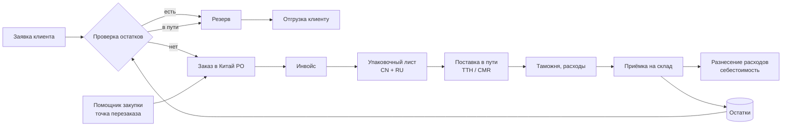

# 2. Бизнес-процессы

> Объём сокращён (07.10.2026): в первой очереди — P3 (упаковочный лист → приход), P5 (приёмка),
> P6 (остатки), P8 (чертежи) и отгрузки заказчикам. P4 (расходы, таможня) — отложен. P1, P7 — вторая очередь.

## Общая схема

## P1. Заказ в Китай

1. Источник потребности: дефицит по заявкам клиентов + рекомендации по точке перезаказа + ручной ввод.
2. Сервис группирует позиции по заводам (у изделия может быть основной и запасной завод).
3. Округляет количество до кратности коробки и MOQ, показывает примерную сумму, вес, объём.
4. Экспорт заказа в формате, который понимает завод (Excel, англ./кит. наименования + коды завода + номера чертежей).
5. Статус PO: черновик → отправлен → подтверждён (PI) → оплачен → отгружен (частично/полностью).

## P2. Приём инвойса

1. Загрузка файла → определение завода (по реквизитам/шаблону) → распознавание строк.
2. Сопоставление каждой строки с изделием: код завода → синонимы → поиск по размерам → ручной выбор.
3. Привязка к PO: сервис показывает, сколько по заказу ещё не отгружено («распределение поступлений»).
   Один инвойс может закрывать несколько PO, один PO — несколько инвойсов.
4. Контроль: цена отличается от цены в PO / прошлой цены > N% → предупреждение.
5. Подтверждение → строки инвойса появляются как «в пути».

## P3. Приём упаковочных листов

1. Загрузка китайского PL и/или русского PL (оба привязываются к одной поставке).
2. Распознавание: диапазон коробок (CTN No. 1–10), кол-во коробок, наименование, шт./коробку,
   всего шт., N.W., G.W., габариты/объём. Учитываем смешанные коробки (несколько позиций в одной).
3. Разнесение по каждой позиции: **кол-во мест, шт. в упаковке, всего шт., вес нетто, вес брутто, объём**.
4. Сверка с инвойсом: количество по каждой позиции должно совпасть; итоги PL CN ↔ PL RU.
5. Шт./коробку запоминается в карточке изделия (для заказа кратно коробке и для приёмки).

## P4. ТТН, транспорт, таможня, расходы

1. Загрузка ТТН/CMR: перевозчик, номер, дата, кол-во мест, вес брутто → сверка с PL.
2. Ввод расходов поставки: фрахт, экспедирование, СВХ, брокер, пошлина, НДС на импорт, сборы,
   банковские комиссии, прочее. Каждый расход: сумма, валюта, дата, курс, документ, **база распределения**.
3. Разнесение расходов по строкам поставки (см. [04-cost-allocation.md](04-cost-allocation.md)).
4. Расходы могут прийти позже приёмки — себестоимость пересчитывается, история сохраняется.

## P5. Приёмка на склад

1. Кладовщик открывает поставку, видит ожидаемое (из PL) по коробкам и позициям.
2. Вводит факт (по позициям или «принято как в PL» + исключения).
3. Расхождения → акт (недостача, излишек, брак, пересорт) → претензия заводу (экспорт).
4. Проводка: остатки увеличиваются, создаётся партия с себестоимостью.

## P6. Остатки

Для каждого изделия:

| Показатель | Откуда |
|---|---|
| На складе | приход − отгрузки ± корректировки |
| В резерве | открытые заявки клиентов |
| Свободно | на складе − резерв |
| В пути | подтверждённые инвойсы, ещё не принятые (+ ETA) |
| Заказано | PO без инвойса |
| Доступно к продаже прогнозно | свободно + в пути + заказано − резервы на будущие поставки |

Фильтры: завод, тип, диаметр, цвет; разрез по партиям и складам; экспорт в Excel.

## P7. Заявка клиента

1. Загрузка: Excel, вставка текста из письма/мессенджера, фото/скан (через ИИ-распознавание).
2. Сопоставление строк с номенклатурой (клиенты пишут по-своему: «патрубок 51мм угол 90 синий» —
   разбираем параметры; при неуверенности — несколько кандидатов на выбор).
3. Ответ по каждой строке: **есть на складе / будет в поставке N (ETA) / нужно заказать / нет в номенклатуре**.
4. Действия: зарезервировать, выгрузить ответ клиенту (Excel/PDF с ценами), отправить дефицит в черновик PO.
5. Новое изделие (нет в номенклатуре) → карточка-черновик + запрос чертежа/цены заводу.

## P8. Чертежи

- У изделия может быть несколько чертежей (версии, разные заводы). Текущая версия помечена.
- Просмотр в браузере по клику из любой таблицы (инвойс, остатки, заявка).
- Загрузка пачкой: имя файла → изделие (по коду), неопознанные — в очередь на привязку.
- Чертёж прикладывается к заказу в Китай автоматически.
