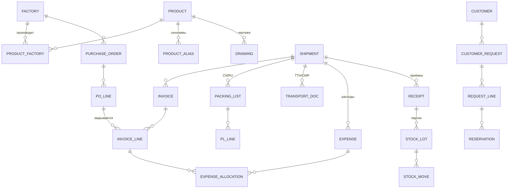

# 3. Модель данных (черновик)

Окончательно утверждается после разбора реальных документов.

## Справочники

**Product (изделие)** — внутренний артикул; тип (прямой, угол 45/90/135, переходник, Т-образный,
гофра/хамп, рукав в бухте, заглушка…); внутренний диаметр(ы) D1/D2, длина/плечи, толщина стенки,
кол-во слоёв, армирование, цвет, температурный диапазон, материал (силикон/фторсиликон внутри),
единица (шт./м), код ТН ВЭД, вес 1 шт., шт. в коробке, MOQ, точка перезаказа, статус.

**Factory (завод)** — название (лат./кит./рус.), реквизиты, валюта, условия (Incoterms), срок
производства, шаблон инвойса/PL (для парсера), контакты.

**ProductFactory** — какой завод производит изделие: код завода, цена, MOQ, шт./коробку, основной/запасной.

**ProductAlias** — синонимы для сопоставления: как изделие названо в инвойсе, PL, заявках клиентов.
Пополняется автоматически при ручном сопоставлении.

**Drawing** — файл (PDF/DWG/JPG), изделие, завод, номер чертежа, версия, дата, текущий/архив.

**Customer, Warehouse, CurrencyRate (НБРБ, на дату), ExpenseType, User/Role.**

## Документы

**PurchaseOrder / POLine** — завод, дата, статус; изделие, кол-во, цена, валюта, отгружено.

**Shipment (поставка)** — номер, завод(ы), вид транспорта (авто/ЖД/море+авто), даты (отгрузка,
ETA, прибытие, выпуск), статус, итоги: мест, брутто, нетто, объём.

**Invoice / InvoiceLine** — номер, дата, завод, валюта, условия; строка: изделие, PO-строка,
кол-во, цена, сумма, исходный текст строки (для аудита распознавания).

**PackingList / PLLine** — язык (CN/RU); строка: коробки с–по, кол-во мест, изделие,
шт./место, всего шт., нетто, брутто, габариты, объём, признак смешанной коробки.

**TransportDoc** — тип (ТТН/CMR/СМГС), номер, дата, перевозчик, места, брутто, транспортное средство.

**Expense / ExpenseAllocation** — тип, контрагент, документ, сумма, валюта, курс, сумма в BYN,
база распределения; строки разнесения: строка инвойса, доля, сумма.

**Receipt / StockLot / StockMove** — приёмка (факт, расхождения); партия (изделие, поставка,
кол-во, себестоимость ед.); движения (приход, отгрузка, резерв, корректировка, списание).

**CustomerRequest / RequestLine / Reservation** — заявка, строки (исходный текст + изделие + кол-во
+ результат проверки), резервы.

## Общие принципы

- Каждый документ хранит **исходный файл** и **историю изменений** (кто, когда, что поправил).
- Статусы: черновик → проверен → проведён. Проведённый документ меняется только через отмену проведения.
- Деньги — в валюте документа + пересчёт в BYN (и USD для аналитики) по курсу на дату.
