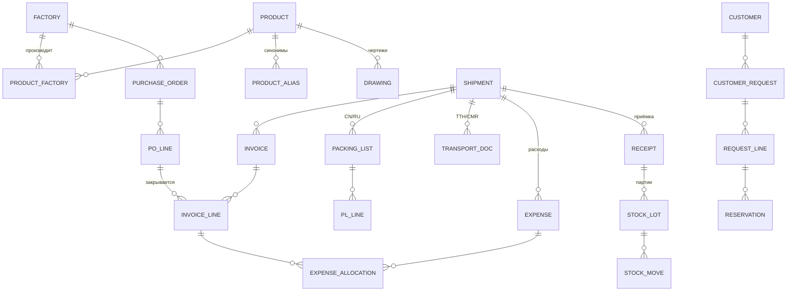

# 3. Модель данных (черновик)

Окончательно утверждается после разбора реальных документов.

## Справочники

**Product (изделие)** — код BSI (напр. `BSI 90-D38L150/140-1`), обозначение чертежа (`ЯПИБ 24.xxxx`),
заказчик (МТЗ / Гомсельмаш / ММЗ / свой), статус (образец на согласовании → согласован → серия → снят); тип (прямой, угол 45/90/135, переходник, Т-образный,
гофра/хамп, рукав в бухте, заглушка…); внутренний диаметр(ы) D1/D2, длина/плечи, толщина стенки,
кол-во слоёв, армирование, цвет, температурный диапазон, материал (силикон/фторсиликон внутри),
единица (шт./м), код ТН ВЭД (3917310008), вес 1 шт. (из штампа чертежа), шт. в коробке, MOQ, точка перезаказа, статус.

**Factory (завод)** — название (лат./кит./рус.), реквизиты, валюта, условия (Incoterms), срок
производства, шаблон инвойса/PL (для парсера), контакты.

**ProductFactory** — какой завод производит изделие: код завода, цена, MOQ, шт./коробку, основной/запасной.

**ProductAlias** — синоним: точная строка из документа → изделие (ЯПИБ), источник (инвойс RU / PL завода /
маркировка коробки / заявка заказчика), кто и когда подтвердил. Создаётся **только подтверждением человека**;
одна строка не может указывать на два изделия. Автоматически не «нормализуется» (см. 09-product-identification.md).

**Drawing** — обозначение ЯПИБ (ключ), код по штампу, заказчик, и **несколько файлов**: исходник (AutoCAD PDF),
скан с подписями согласования, архивные версии; статус (на согласовании / согласован / архив). Рабочая среда, температура, давление, материал — из примечаний.

**Customer (заказчик)** — МТЗ, Гомсельмаш, ММЗ и др.: и владелец чертежей, и источник заявок.

**Customer, Warehouse, CurrencyRate (НБРБ, на дату), ExpenseType, User/Role.**

## Документы

**PurchaseOrder / POLine** — завод, дата, статус; изделие, кол-во, цена, валюта, отгружено.

**Shipment (поставка)** — номер, завод(ы), вид транспорта (авто/ЖД/море+авто), даты (отгрузка,
ETA, прибытие, выпуск), статус, итоги: мест, брутто, нетто, объём.

**Invoice / InvoiceLine** — номер (TS…), дата, договор (09/185), заказы завода (Q571, Q595…), валюта (CNY), Incoterms (EXW); строка: изделие, PO-строка,
кол-во, цена, сумма, исходный текст строки (для аудита распознавания).

**PackingList / PLLine** — язык (CN/RU); строка: коробки с–по, кол-во мест, изделие,
шт./место, всего шт., нетто, брутто, габариты, объём, исходные тексты (код модели + кит. маркировка).

**MixedCarton** — смешанная коробка (маркировка `TS2407202-B`…): общий вес/объём и список позиций
с кол-вом; вес по позициям считается расчётом по массе 1 шт.

**TransportDoc** — тип (ТТН/CMR/СМГС), номер, дата, перевозчик, места, брутто, транспортное средство.

**Expense / ExpenseAllocation** — тип, контрагент, документ, сумма, валюта, курс, сумма в BYN,
база распределения; строки разнесения: строка инвойса, доля, сумма.

**Receipt / StockLot / StockMove** — приёмка (факт, расхождения); партия (изделие, поставка,
кол-во, себестоимость ед.); движения (приход, отгрузка, резерв, корректировка, списание).

**CustomerRequest / RequestLine / Reservation** — заявка, строки (исходный текст + изделие + кол-во
+ результат проверки), резервы.

## Общие принципы

- Каждый документ хранит **исходный файл** и **историю изменений** (кто, когда, что поправил).
- Статусы: черновик → проверен → проведён. Проведённый документ меняется только через отмену проведения.
- Цены храним с точностью до 10 знаков (у завода цены не округлены), суммы строк — как в документе.
- Деньги — в валюте документа + пересчёт в BYN (и USD для аналитики) по курсу на дату.
