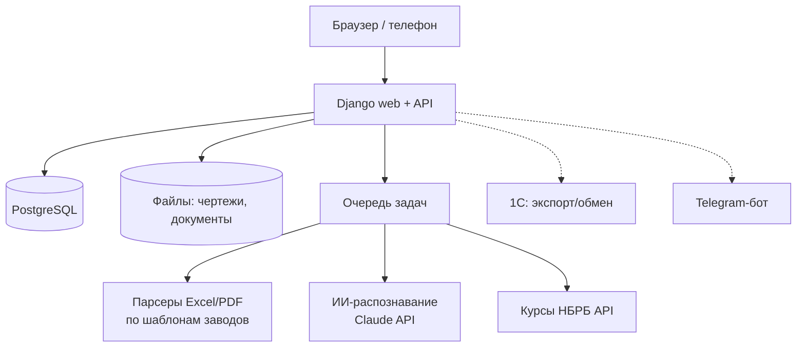

# 5. Архитектура и технологии

## Предлагаемый стек

| Слой | Технология | Почему |
|---|---|---|
| Backend | **Python 3.12 + Django 5** | Быстрая разработка учётных систем: ORM, миграции, авторизация, готовая админка для справочников; Python — лучшие библиотеки для Excel/PDF |
| API | Django REST Framework | для фронтенда, бота, интеграций (1С) |
| База данных | **PostgreSQL 16** | надёжность, транзакции, точные денежные типы, полнотекстовый поиск |
| Frontend | Django-шаблоны + HTMX (+ Alpine.js), таблицы с редактированием | простота, быстро, без отдельного SPA; при необходимости потом React |
| Excel | openpyxl, pandas | чтение инвойсов/PL, экспорт отчётов и заказов |
| PDF | pdfplumber / PyMuPDF | текстовые PDF; просмотр чертежей — PDF.js в браузере |
| ИИ-распознавание | Claude API (Anthropic) | сканы, фото, PDF без текстового слоя, китайский текст, «свободные» заявки клиентов → JSON по схеме |
| Фоновые задачи | Celery/RQ + Redis | распознавание, пересчёты, загрузка курсов НБРБ |
| Файлы | S3-совместимое хранилище (Yandex Object Storage / MinIO) или диск сервера | чертежи и исходные документы |
| Развёртывание | Docker Compose на VPS (РБ/РФ/EU — по вашим требованиям) | одна команда для запуска, бэкапы БД ежедневно |
| Качество | pytest, ruff, GitHub Actions CI | тесты на парсеры по реальным образцам из `samples/` |

## Схема

## Распознавание документов — как будет устроено

1. **Excel от известного завода** → детерминированный парсер по шаблону (колонки, заголовки).
   Быстро, бесплатно, точно. Для каждого завода — свой небольшой «профиль шаблона».
2. **PDF / скан / незнакомый формат** → ИИ извлекает данные в строгую JSON-схему
   (номер, дата, строки: код, описание, кол-во, цена…).
3. **Проверка арифметики**: кол-во × цена = сумма, Σ строк = итог, Σ коробок = итог мест.
   Не сходится — строка подсвечивается.
4. **Сопоставление с номенклатурой**: точный код завода → синоним → разбор параметров
   (диаметр, угол, длина, цвет) → нечёткий поиск → ручной выбор. Выбор пользователя запоминается.
5. Человек подтверждает черновик. Без подтверждения в учёт ничего не попадает.

## Безопасность и данные

- Вход по логину/паролю, роли, журнал действий.
- Ежедневный бэкап БД и файлов, хранение 30 дней.
- Документы с ценами не уходят никуда, кроме ИИ-распознавания (если вы его разрешите; можно
  отключить и работать только с Excel-парсерами).
